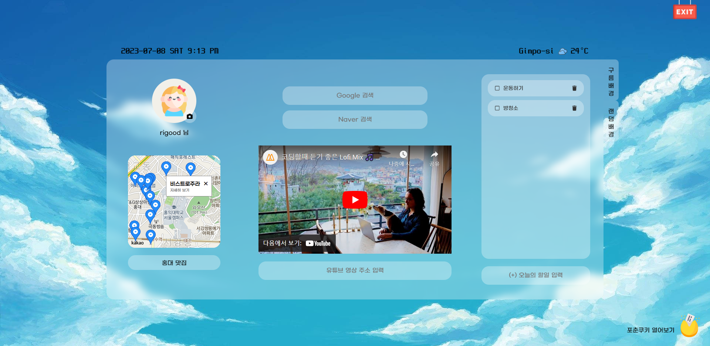
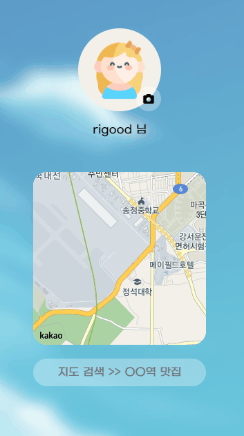
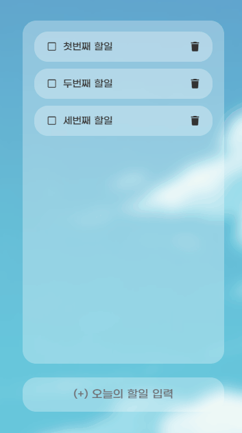
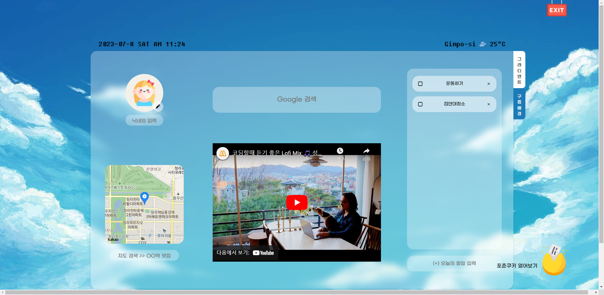

## ☁ Momentum

- **바닐라 JS**로 만든 **크롬 시작화면 앱**입니다.
- [DEMO 바로가기](https://rigood.github.io/momentum_2022/)

 

## 1. 프로젝트 소개

- 개발 (2022-08-13 ~ 2022-08-15)
- 1차 업데이트 (2023-07-09)
- [노마드코더 바닐라JS 챌린지 27기 👑 우수 졸업작품](https://nomadcoders.co/community/thread/5757)

 

## 2. 주요 기능

- 사용자 **`위치 기반 🌞날씨 정보`** 제공
- 프로필 사진, 닉네임 설정
- **`카카오 🚩지도 API`** 를 이용한 장소 검색 기능
- 구글·네이버 검색, 유튜브 플레이어
- **`🤚드래그 앤 드롭`** 이 가능한 Todo List
- 배경화면 랜덤 변경, 포춘쿠키 열기
- **`📂localStorage`** 에 현재 앱 상태(프로필 정보, Todo List, 유튜브 영상 ID 등) 저장

 

## 3. 업데이트 기록

### v1.1

- 전반적인 코드 리팩토링
- **`지도 검색`** 결과에서 마커 클릭 시 해당 장소에 대한 정보를 담은 **`커스텀 오버레이`** 표시
- 유튜브 영상 변경 기능 추가
- **`Todo List 드래그 앤 드롭`** 기능 추가
- 네이버 검색 추가
- 포춘쿠키 1일 1회만 오픈 할 수 있도록 수정
- localStorage에 포춘쿠키, 배경화면 정보 저장

|                          지도 검색 & 커스텀 오버레이                           |                              Todo List 드래그 앤 드롭                               |
| :----------------------------------------------------------------------------: | :---------------------------------------------------------------------------------: |
|  |  |

 

### v1.0

 

## 4. 출처

- [구름 아이콘 제작자: kosonicon - Flaticon](https://www.flaticon.com/kr/free-icons/)
- [구름 배경 제작자: Cee](https://www.theskyandthesea.com/art/)
